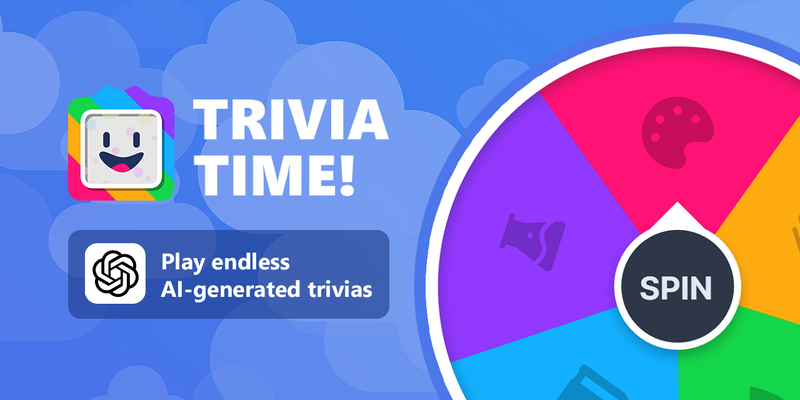

# [Trivia Time!](https://triviatime.vercel.app/)
<h2>
Fullstack web application made with Next.js 13, Supabase and Prisma.
</h2>

Play AI-generated trivias and explore the fascinating worlds of art, entertainment, geography, history, and science. Immerse yourself in captivating quizzes that will test your knowledge across a wide range of subjects. Compete with people around the world, climb the leaderboard, and become a true trivia master.

## Tech Stack

- [Next.js](https://nextjs.org)
- [Chakra UI](https://chakra-ui.com/)
- [NextAuth/Auth.js](https://authjs.dev/)
- [Supabase](https://supabase.com/)
- [React Email](https://react.email)
- [Prisma](https://www.prisma.io/)
- [React Hook Form](https://react-hook-form.com/)
- [Zustand](https://zustand-demo.pmnd.rs/)

- ## Features

- Authentication with NextAuth
- Database on Supabase
- Users leaderboard
- OpenAI's GPT API integration
- Form validation with Zod and React Hook Form
